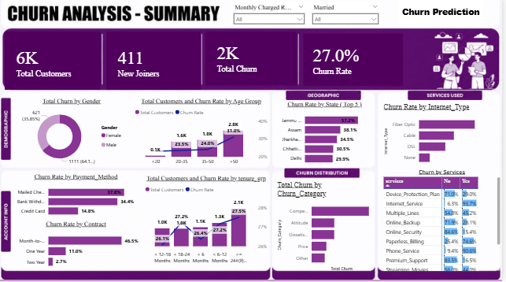
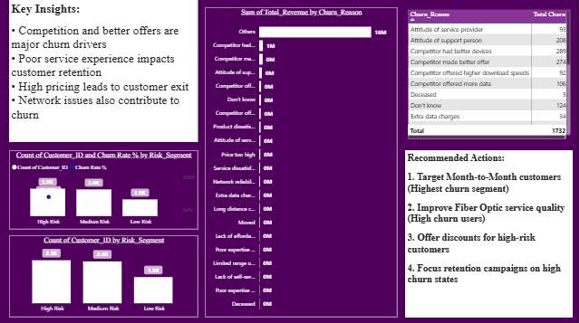
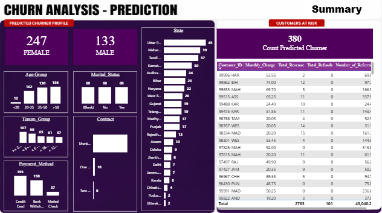

**Customer Churn Analysis & Retention Strategy**
> End-to-End Data Analytics Project using SQL, Power BI & Machine Learning
> to identify customer churn and drive retention strategies

##  Project Highlights
- End-to-end data analytics pipeline (SQL → Power BI → ML)
- Built predictive churn model with 84% accuracy
- Identified key business drivers impacting churn
- Designed interactive dashboards for decision-making
- Provided actionable retention strategies
  
## Project Overview
Customer churn is a critical business problem that directly impacts revenue and growth.

This project analyzes customer data to:
- Identify churn patterns
- Understand key drivers
- Predict high-risk customers
- Provide actionable retention strategies
- Built using a complete analytics pipeline: SQL → Power BI → Machine Learning

## Project Objectives
a) Analyze customer behavior across:
1.Demographics
2.Geography
3.Services
4.Billing & payment

b) Identify:
1.Who is churning
2.Why they are churning

c) Measure:
1.Revenue loss
2.High-value churn
3.Segment customers:
4.Tenure-based
5.Value-based
6.Risk-based
d) Predict future churn using Machine Learning

## Project Workflow
1. Data Collection (CSV dataset)
2. Data Cleaning & Transformation (SQL)
3. Exploratory Data Analysis (SQL)
4. Dashboard Development (Power BI)
5. Machine Learning Model (Python)
6. Prediction & Business Insights

## Tech Stack
1. SQL → Data cleaning, joins, analysis
2. Power BI → Dashboard & visualization
3. Python (Scikit-learn) → Machine Learning
4. Excel / CSV → Data source

## Dashboard Preview
• Summary Dashboard
1.Total Customers
2. Total Churn
3. Churn Rate
4. Revenue Loss
• Churn Analysis Dashboard
1. Churn by Contract Type
2. Churn by Payment Method
3. Churn by Service Type
• Prediction Dashboard
1. High-Risk Customers
2. Retention Opportunities

## Key Business Insights
1. Contract Type Drives Churn
• Month-to-month customers show the highest churn
• Long-term contracts significantly reduce churn
2. Pricing Impact
• High monthly charges → higher churn probability
• Customers are price-sensitive
3. Tenure Effect
New customers churn more frequently
Long-term customers are more stable
4. Payment Method Influence
• Electronic payment users show higher churn
5. Service Usage Behavior
• Internet and streaming services impact churn
• Add-on services influence retention
6. Revenue Risk
• High-value customers are also churning
• Indicates potential revenue leakage

## Machine Learning Model
Model Used
1) Random Forest Classifier
• Data Processing
• Removed unnecessary columns
• Encoded categorical variables
Target variable:
a. Stayed → 0
b. Churned → 1

2) Model Performance
• Accuracy: ~84%
• Precision: 0.80
• Recall: 0.59
• F1 Score: 0.68
The model performs well overall, but recall for churn prediction can be improved to capture more at-risk customers.
Model is slightly biased towards non-churn class needs recall improvement.

## Key Features Driving Churn
a. Contract Type
b. Total Charges
c. Monthly Charges
d. Tenure
e. Total Revenue

## Prediction Output
1. Predicts high-risk customers
2. Filters churn-prone users
3. Outputs results as CSV for business use

## Business Recommendations
1. Promote Long-Term Contracts
• Offer discounts for yearly plans
2. Pricing Optimization
• Provide personalized offers for high-risk users
3. Early Retention Strategy
• Focus on customers in first 3–6 months
4. Protect High-Value Customers
• Introduce loyalty programs
5. Payment-Based Targeting
• Target users with electronic payment methods
6. AI-Driven Retention
• Use ML predictions to trigger retention campaigns

## Dashboard Preview

### Summary Dashboard

### Churn Analysis Dashboard

### Prediction Dashboard

## Author
**Sureka R**
Aspiring Data Analyst.

Skills: SQL | Power BI | Python.
Focus: Business Analytics & Machine Learning.

  ## Connect with me:
  
  -Linkdein (www.linkedin.com/in/sureka26)
  
  -GitHub (https://github.com/Sureka26)
